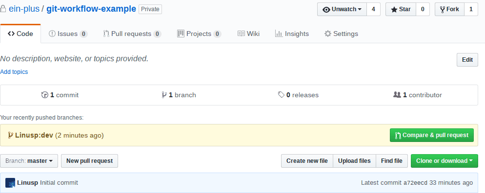

# Git Workflow Example

本项目用于练习和熟悉我司的协同开发流程

## Fork

点击右上方的 `Fork` 按钮，将本项目 fork 到您的个人帐号下

## Clone 并配置上游仓库

请在本地执行下面的命令（假设您的 `Github` 用户名为 `gomez`）

```shell
git clone git@github.com:gomez/git-workflow-example
```

这将会在您的本地创建一个 `git-workflow-example` 的目录，该目录中包含本仓库的所有内容

同时请配置好上游仓库，执行如下命令

```shell
cd git-workflow-example
git remote add upsatream git@github.com:ein-plus/git-workflow-example
```

## 一个完整的开发流程

### 同步上游仓库代码

如非必要，不要在 `master` 分支提交代码，而是靠 `master` 分支来同步上游仓库的代码，进入项目目录后，执行如下命令

```shell
git checkout master       # 切换到 master 分支
git pull upstream master  # 将上游仓库的 master 分支的代码，拉取并同步到本地的 master 分支
```

### 创建或切换到非 `master` 分支

如非必要，请一直在非 `master` 分支提交你的个人修改，以下是一个示例

```shell
git checkout master     # 首先切换到 master 分支
git checkout -b dev     # 从 master 分支中，创建一个 dev 分支，该分支的起点和 master 是一样的
```

创建了新的分支后，就可以进行开发、修改、提交了，如：

```shell
vim fizzbuzz.py      # 新建 fizzbuzz.py 并进行开发，完成后保存退出
git add fuzzbuzz.py  # 将 fizzbuzz.py 的改动添加到缓存区
git commit -m "implemented `FizzBuzz`"  # 确认无误后将改动正式提交到本地仓库中
```

### 提交代码到 Github

开发完成后，即可将代码提交到 Github，但在执行 `git push` 前，请重复第一步「同步上游仓库代码」—— 在你进行修改的同时，有可能有其他人也做了修改并已经提交，我们必须保证我们的代码是基于最新的代码来进行修改的。

```shell
git checkout master
git pull upstream master
```

同步完 `master` 分支后，我们同时需要更新我们的 `dev` 分支，将 `master` 分支的新的改动合并进来，这个有两种方式

1. 使用 `git merge` 来合并 `master` 分支的改动

```shell
git checkout dev    # 从 master 分支切换回开发分支
git merge master    # 将 master 分支的新代码合并到当前分支
```

在 `merge` 的过程中可能会有冲突，请小心处理并解决。

2. 使用 `git rebase` 来将 `dev` 分支的起点移动到 `master` 分支的最新版本

```shell
git checkout dev    # 从 master 分支切换回开发分支
git rebase master   # 移动当前分支的起点到 master 分支的最新版本
```

在 `rebase` 的过程中可能会有冲突，请小心处理并解决。

上述同步上游仓库的过程较繁琐且易出错，但我们希望您能严格遵循这个过程。

在同步完上游仓库的代码后，我们就可以把我们开发分支的代码推送到 `Github` 了

```shell
git push origin dev   # 将当前分支的代码推送到 Github 仓库的 dev 分支
```
### 提交 Pull Request(PR)

上一步提交更改后，我们只是把新的修改推送到了 **个人帐号** 的仓库中，如果希望我们的改动能被别人使用，我们还需要将这些改动合并到上游仓库，也就是用户 `ein-plus` 的仓库中去。这个过程是通过 `Github` 的 `Pull Request` 来实现的，请按以下步骤进行：

1. 进入上游仓库的 `Github` 页面，如：https://github.com/ein-plus/git-workflow-example/

2. 点击页面上的 `New Pull Request` 按钮，并选择 `compare across forks`，在右侧选择自己帐号下的仓库和对应的分支

如下图所示



### Code Review

提交 PR 后，即可在 PR 页面，请求相关人员对这个 PR 进行 review，所谓的 review，包括提出改进意见、讨论实现细节等。以下都是可行的方式

1. 在 PR 页面右侧的「Reviewers」中添加相关的 Github 用户，他们将会收到邮件通知

2. 在 PR 页面的评论中 @ 相关 Github 用户

3. 在 BearyChat(我们的 IM 工具) 中 @ 相关的用户，希望他人尽快 review 自己的 PR 时可采用这种方式

4. 在办公室中找到相关人员，要求对方进行 review，希望他人尽快 review 自己的 PR，且对方对上述三种方式都无响应时可采用这种方式

在 review 的过程中，别人提出意见后，我们可以做对应的修改，这些修改继续推送到对应的开发分支(如之前的 `dev`)即可， **不需要重新提交 Pull Request**，只要 PR 没有被接受，该 PR 将会持续追踪我们的开发分支，并将新的改动展示出来。

经 reviewer 确认后，PR 可以被合并，至此，一个完整的流程结束。

请在 Code Review 中注意

1. 讨论是公开、公平的，不存在谁指导谁的问题，review 是为了保证代码的公开透明及代码规范、代码效率，请对事不对人

2. 作为 reviewer，请仔细阅读 PR，如果有不符合公共规范的请务必指出；如果觉得在规范、效率各方面都符合要求，那么请及时确认 —— 在 review 中点击 `Approve` 或者在 PR 页面中通过评论来告知

3. 作为提交代码者，请虚心接受别人的**合理**建议，并及时作出更改

4. 作为提交代码者，如非必要，请**不要自己合并自己的 PR**
